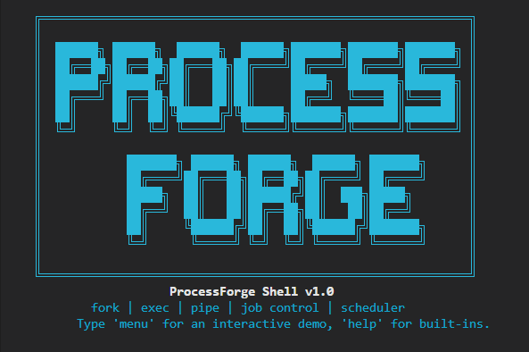
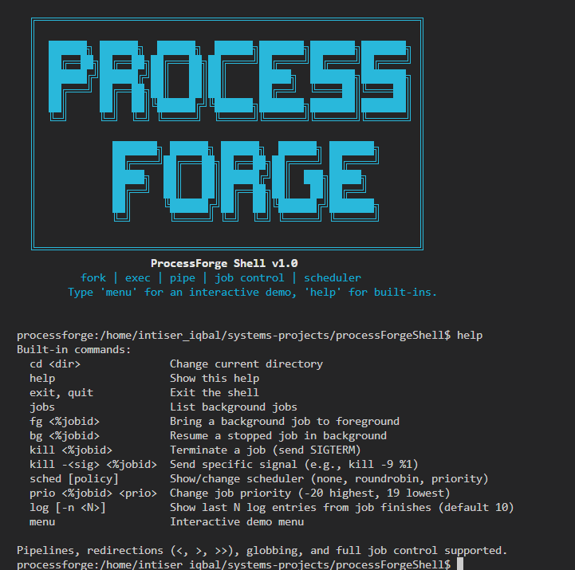
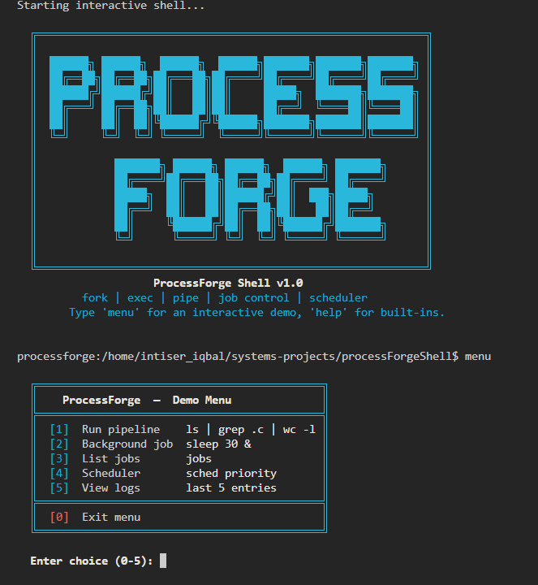

# ProcessForge Shell

[](https://github.com/intiserIqbal/processforge-shell)
[](https://github.com/intiserIqbal/processforge-shell)
[](LICENSE)
[](https://tiswww.case.edu/php/chet/readline/rltop.html)
[](https://en.wikipedia.org/wiki/C99)
[](https://github.com/intiserIqbal/processforge-shell)

<p align="center">
  
</p>


**ProcessForge Shell** is a research-grade Unix-like shell written in C. It demonstrates low-level process management, custom user-space scheduling (round-robin, priority), full POSIX job control, and structured logging — all within an interactive environment powered by GNU Readline.

---

## Full Demo

[](https://youtu.be/fzSygFkm2BE)

> Walk through every feature: background jobs, signal handling, scheduler policies, priority changes, log viewer, and the interactive menu.

---

## Table of Contents

- [Basic UNIX Features](#basic-unix-features)
- [Job Control](#job-control)
- [Scheduler Policies](#scheduler-policies)
- [Changing Job Priority](#changing-job-priority)
- [Log Viewer](#log-viewer)
- [Interactive Menu](#interactive-menu)
- [Command History and Editing](#command-history-and-editing)
- [Development Logs](#development-logs)
- [Acknowledgements](#acknowledgements)
- [License](#license)

---

## Basic UNIX Features

ProcessForge supports all essential UNIX shell operations:

- **External commands** — `ls`, `grep`, `sleep`, `echo`, `cat`, and any executable on `$PATH`
- **Pipelines** — unlimited stages: `ls | grep .c | sort | wc -l`
- **Redirections** — `<`, `>`, `>>` (input, output, append)
- **Globbing** — `*.c`, `src/*.h` expanded before execution
- **Built-ins** — `cd`, `help`, `exit`, `quit`, `jobs`, `fg`, `bg`, `kill`, `sched`, `prio`, `log`, `menu`

<p align="center">
  
</p>

Type `help` inside the shell for the complete built-in reference.

---

## Job Control

Full job control is implemented with process-group semantics, terminal ownership transfer, and zombie-free child reaping.

| Command | Action |
|---|---|
| `sleep 30 &` | Start process in background; prints `[1] <pid>` |
| `jobs` | List all background jobs with state (Running / Stopped) |
| `fg %1` | Bring job 1 to foreground; resumes it if stopped |
| `Ctrl-Z` | Stop the current foreground job |
| `bg %1` | Resume a stopped job in the background |
| `kill %1` | Send `SIGTERM` to the entire process group of job 1 |
| `kill -9 %1` | Send `SIGKILL` to the entire process group of job 1 |

**Example session:**

```bash
processforge:~$ sleep 30 &
[1] 12345
processforge:~$ sleep 40 &
[2] 12346
processforge:~$ jobs
[1]  Running   sleep 30 &
[2]  Running   sleep 40 &
processforge:~$ fg %2
^Z
[2] Stopped  sleep 40
processforge:~$ bg %2
[2] sleep 40 &
processforge:~$ kill %1
Signal 15 sent to job 1 (pgid 12345)
kill: job 1 terminated, cleaning up
```

The shell correctly transfers terminal ownership via `tcsetpgrp`, handles `SIGTSTP` and `SIGCONT`, and reaps all children through a `SIGCHLD` handler without producing zombie processes.

---

## Scheduler Policies

ProcessForge includes a **custom user-space scheduler** that controls which background jobs are permitted to run at any given time, entirely without kernel modifications. The policy is changed at runtime with the `sched` built-in.

| Policy | Behaviour |
|---|---|
| `none` | Kernel default — all background jobs run concurrently |
| `roundrobin` | One background job runs at a time; jobs rotate every 50 ms |
| `priority` | Only the background job with the lowest `priority` value runs |

```bash
processforge:~$ yes > /dev/null &
[1] 22001
processforge:~$ yes > /dev/null &
[2] 22002
processforge:~$ sched roundrobin
Scheduler policy changed to 'roundrobin' (50 ms timeslices).
```

After switching to `roundrobin`, only one `yes` process consumes CPU at a time. The scheduler uses `SIGSTOP` and `SIGCONT` to pause and resume jobs — no privilege escalation required.

To query the current policy without changing it:

```bash
processforge:~$ sched
Scheduler policy: roundrobin
```

---

## Changing Job Priority

The `prio` built-in assigns a scheduling priority to a background job in the range **-20** (highest) to **19** (lowest). The change takes effect immediately when the scheduler is in `priority` mode.

```bash
processforge:~$ sleep 300 &
[1] 33001
processforge:~$ prio %1 -5
Job 1 (pgid 33001) priority set to -5
```

If the active policy is not `priority`, the shell prints an advisory:

```
Note: scheduler policy is not 'priority'. Use 'sched priority' to activate.
```

---

## Log Viewer

Every executed command — foreground or background — is appended to `/tmp/processforge.log` in CSV format upon completion. Each record captures:

- Timestamp (12-hour format)
- Wall-clock duration (ms)
- User CPU time (ms)
- System CPU time (ms)
- Process group ID
- Command string
- Exit status (or signal number on abnormal termination)

The `log` built-in renders the last N entries in a colour-coded, boxed table:

```bash
processforge:~$ log
  ╔═══════════════════════════════════════════════════════════════╗
  ║  Timestamp                Command                    Status   ║
  ╠═══════════════════════════════════════════════════════════════╣
  ║  2026-05-03 02:27:32 PM   ls | grep .c | wc -l       [ OK ]   ║
  ║  2026-05-03 02:28:48 PM   whereami                   [ERR ]   ║
  ║  2026-05-03 03:12:55 PM   echo hello                 [ OK ]   ║
  ╚═══════════════════════════════════════════════════════════════╝
```

Successful exits are displayed in green; non-zero exits in red. Use `log -n <N>` to limit output to the last N entries.

---

## Interactive Menu

Type `menu` to launch a self-contained, boxed interactive demo — useful for demonstrations and quick exploration without memorising commands.

<p align="center">
  
</p>

```
  ╔════════════════════════════════════════════╗
  ║    ProcessForge  —  Demo Menu              ║
  ╠════════════════════════════════════════════╣
  ║  [1]  Run pipeline    ls | grep .c | wc -l ║
  ║  [2]  Background job  sleep 30 &           ║
  ║  [3]  List jobs       jobs                 ║
  ║  [4]  Scheduler       sched priority       ║
  ║  [5]  View logs       last 5 entries       ║
  ╠════════════════════════════════════════════╣
  ║  [0]  Exit menu                            ║
  ╚════════════════════════════════════════════╝
```

Each selection executes the corresponding command, wraps its output in a labelled box, and pauses before redrawing the menu. The screen is cleared between iterations to prevent output accumulation.

---

## Command History and Editing

Line editing and history are provided by **GNU Readline**:

- **Up / Down arrows** — navigate command history
- **Left / Right arrows** — move the cursor for in-line editing
- **Ctrl-A / Ctrl-E** — jump to start / end of line
- **Persistent history** — automatically saved to `~/.processforge_history` across sessions

The prompt dynamically reflects the number of active background jobs:

```
[2] processforge:/home/user/project$
```

When no background jobs are running, the `[N]` prefix is omitted.

---

## Building and Running

**Dependencies:** GCC, GNU Make, GNU Readline (`libreadline-dev` on Debian/Ubuntu).

```bash
# Clone
git clone https://github.com/intiserIqbal/processforge-shell.git
cd processforge-shell

# Build
make

# Run
./processforge
```

To clean build artefacts:

```bash
make clean
```

Tested on Ubuntu 22.04 LTS and WSL2 (Windows 11). macOS is not supported due to differences in `SIGCHLD` semantics and `tcsetpgrp` behaviour.

---

## Project Structure

```
processforge-shell/
├── src/
│ ├── main.c # Shell loop, readline integration, dynamic prompt
│ ├── parser.c # Tokeniser, pipeline & redirection parser
│ ├── executor.c # fork/exec, pipeline execution, redirections
│ ├── jobs.c # Job table, SIGCHLD handler, job reaping
│ ├── builtins.c # All built‑in commands (cd, help, jobs, fg, bg, kill, sched, prio, log, menu)
│ ├── logging.c # CSV logging with deferred signal‑safe queue
│ ├── signals.c # Setup signal handlers for the shell
│ └── scheduler.c # User‑space scheduler (none / roundrobin / priority)
├── include/
│ ├── shell.h
│ ├── jobs.h
│ ├── logging.h
│ ├── scheduler.h
│ ├── signals.h
│ └── logo.h # ASCII art banner
├── docs/
│ ├── assets/ # Screenshots (help.png, interactive_table.png, logo.png)
│ └── devlogs/ # Daily development notes (Day 1–9)
├── tests/ # Shell behaviour test scripts (optional, not yet fully automated)
├── scripts/ # Installer script (install.sh)
├── .gitignore
├── Dockerfile
├── LICENSE
├── Makefile
└── README.md
```

---

## Development Logs

Daily implementation notes are available in [`docs/devlogs/`](docs/devlogs/):

| Day | Topic |
|---|---|
| [Day 1](docs/devlogs/devlog_day01.md) | Core shell loop, built-ins, fork/exec |
| [Day 2](docs/devlogs/devlog_day02.md) | Single-stage pipelines |
| [Day 3](docs/devlogs/devlog_day03.md) | Redirections and parser fixes |
| [Day 4](docs/devlogs/devlog_day04.md) | Multi-stage pipelines and test suite |
| [Day 5](docs/devlogs/devlog_day05.md) | Job control foundations and SIGCHLD handling |
| [Day 6](docs/devlogs/devlog_day06.md) | Full job control (`fg`, `bg`, `kill`) |
| [Day 7](docs/devlogs/devlog_day07.md) | Instrumentation and logging |
| [Day 8](docs/devlogs/devlog_day08.md) | User-space scheduler (round-robin, priority) |
| [Day 9](docs/devlogs/devlog_day09.md) | UX enhancements (readline, menu, prio, formatted log) |

---

## Acknowledgements

- **My professor** – for piquing my interest in operating systems and encouraging low‑level systems exploration
- **Silberschatz, Galvin & Gagne** – *Operating System Concepts, 10th Edition*, which provided the foundational knowledge of process management, job control, and scheduling
- GNU Readline — for line editing and persistent history
- The design of classic UNIX shells (bash, dash) — for reference on POSIX job control semantics

---

## License

[MIT License](LICENSE) — free to use, modify, and distribute with attribution.

---

## Contact

Open an issue on [GitHub](https://github.com/intiserIqbal/processforge-shell) or reach out via the repository's discussion tab.

---

*"What Is Now Proved Was Once Only Imagined." — William Blake*